# Geopolitics Economy Game – Development Checklist

Use the sections below as a **master checklist**. Tick items as you implement them; sub-items are ordered so early ones unblock later ones. See [BRAINSTORM.md](BRAINSTORM.md) for core concept.

**Testing after each stage:** When you finish a stage, run **`npm test`** (this runs all tests, including previous stages), add or update unit tests for any new logic, then do a quick manual check (e.g. `npm run dev`). Before pushing, run the full suite so everything stays tested.

**Playable game goal:** By the end, the app must support: **main menu** (New Game / Load / Settings), **in-game pause menu** (Resume, Save, Main Menu), **save/load** (persist and restore full state), **victory/defeat screens** (with Restart or Main Menu), and **settings** (e.g. volume, fullscreen) persisted. See section **H. Game flow, menus & persistence** and the updated F/G items below.

**RTS pillars (reference):** A real-time strategy game needs (1) **economy building** – resources, production chains, construction; (2) **attacking** – deploying forces against opponents; (3) **defending** – protecting territory and assets. Each takes time so players make trade-offs. The plan below covers these; we also add **economy balance** (sources vs sinks), **AI opponents**, **fog of war / minimap** (optional), and **pathfinding** for unit orders.

**Knights and Merchants alignment (reference):** The game is inspired by [Knights and Merchants](https://www.knightsandmerchants.net/) (KaM). Ensure the plan does not miss these KaM-like elements: **(1) Roads/connectivity** – every building must be connected (by road or route) for goods to flow; placement invalid if not connected. **(2) Multi-step production chains** – raw → intermediate → end (e.g. grain → mill → bakery → bread); we have this in C/D. **(3) Food consumption** – population or units consume food over time; starvation = death or severe penalty (stability drop, unit loss). **(4) Training/recruitment costs** – producing workers or soldiers costs resources (e.g. currency/gold + time); no free units. **(5) No hard unit cap** – army size limited by economy and food, not an arbitrary cap. **(6) Currency resource** – at least one resource used for training, hiring, or upgrades (e.g. gold). **(7) Storage/capacity (optional)** – stockpiles or buildings have capacity; overflow or “no storage” affects flow. **(8) Unit types** – at least 2–3 military unit types (e.g. by equipment or role) with different cost and strength. **(9) Worker/citizen population (optional)** – train workers at a building; they carry goods between buildings or build; they consume food. The checklist below bakes (1)–(6) and (8) in; (7) and (9) are optional and called out in C/D.

---

## 1. Instructions for developers and agents

**Use this section as the single source of truth for how to work on this project. Follow it in order.**

### 1.1 Development path (mandatory order)

Work through the checklist in this exact order. Do not skip sections. Complete every unchecked item in a section before moving to the next; tick each item in this file (change `- [ ]` to `- [x]`) when it is done.

1. **A** – Foundation & tech stack  
2. **B** – Procedural rendering (no textures)  
3. **B.1** – Real-world country borders  
4. **B.2** – Procedural visual clarity  
5. **C** – Data model & simulation  
6. **D** – Economy & balance  
7. **E** – Geopolitics layer (countries, conflict, defend)  
8. **F** – Player input & UX (selection, orders, pathfinding, save/load, optional minimap/fog, game speed)  
9. **G** – Content & polish  
10. **H** – Game flow, menus & persistence  
11. **I** – AI players  

Dependencies: B.2 comes *after* B.1 (real borders). H (menus/save) and F (save/load) overlap—implement save/load in F and the persistence layer in H. I (AI) is after E (conflict) and F (input) so the AI can issue the same orders.

### 1.2 Tech stack (do not change without updating this plan)

- **Runtime:** Browser (Vite dev server or static build).  
- **Code:** TypeScript; entry `src/main.ts`; Canvas 2D for all rendering (no WebGL unless the plan is updated).  
- **Tests:** Vitest; `npm test` runs all tests; test files live next to source (e.g. `src/foo.test.ts`).  
- **Persistence:** localStorage and/or file download/upload (no backend server).  
- **No textures:** All art is programmatic (shapes, lines, colors). Do not add image or texture assets.

### 1.3 Definition of done (per section)

A section is **done** only when:

1. Every checklist item in that section is ticked (`- [x]`) in this file.  
2. **`npm test`** passes (all tests green).  
3. New or changed logic has corresponding unit tests (add or update `src/*.test.ts`).  
4. **`npm run dev`** runs without errors and the new behavior is manually verified in the browser (e.g. new UI appears, new action works).  
5. **`npm run build`** succeeds (no build errors).

If an item is optional (marked "optional" in the plan), you may leave it unchecked and document it in a short "Deferred" note; otherwise treat it as required.

### 1.4 Rules for agents

- **Read the full plan** (this file and [BRAINSTORM.md](BRAINSTORM.md)) before writing code.  
- **Implement one section at a time** (or one logical sub-block). Do not implement multiple sections in one go unless explicitly asked.  
- **Update this file** when you complete items: tick checkboxes, add brief "Implementation note" only if you leave optional items deferred.  
- **Run `npm test`** after every code change that touches logic; fix failing tests before moving on.  
- **Do not remove or rewrite existing tests** unless the feature is removed or the contract changes; add tests for new behavior.  
- **Do not edit the plan file** stored in `.cursor/plans/` (if present); edit only **docs/PLAN.md** in the repo.  
- When in doubt, prefer the order in **§1.1** and the checklist in **§2**; when the diagram in **§3** conflicts with the checklist order, **§1.1 and §2 win**.

---

## 2. Plan package (checklist structure)

### A. Foundation & tech stack

- [x] Choose stack (e.g. web: Canvas/WebGL + JS/TS; or native: e.g. Godot, Unity with minimal assets; or Rust/Go + SDL).
- [x] Set up project, build, and run loop.
- [x] Implement a minimal **game loop** (tick/update, render).
- [x] Implement **camera/view** (pan, zoom) over a 2D play area.
- [x] Define **coordinate system** (world vs. screen, cell/hex vs. free placement).
- [x] **Tests:** Unit tests for coords/camera (worldToScreen, screenToWorld, round-trip); run `npm test`.

### B. Procedural rendering (no textures)

- [x] **Terrain**: generate and draw regions (e.g. grid or hex) with colors from rules (elevation, "biome", ownership).
- [x] **Borders**: draw country/region borders as lines (polygon edges or explicit border segments).
- [x] **Buildings**: draw as simple shapes (rect/circle) with type and level affecting size/color; optional icon shapes.
- [x] **Units/armies**: draw as symbols (dot, triangle) with color = owner, optional size = strength.
- [x] **Routes**: draw lines between buildings or regions (trade routes, supply lines).
- [x] **UI**: panels, resource bars, and icons as programmatic shapes/lines.
- [x] Optional: light animation (idle pulse, movement along routes).
- [x] **Tests:** Terrain/borders unit tests; run `npm test`; manual check in browser.

### B.1 Real-world country borders (data-driven)

- [ ] Add dependency: `world-atlas` (and optionally `topojson-client`) or load TopoJSON from CDN.
- [ ] Load Natural Earth country data (e.g. `countries-110m.json` or `countries-50m.json`); decode TopoJSON to GeoJSON (lon/lat polygons).
- [ ] Define world map extent and projection (equirectangular or Mercator): map (lon, lat) to world (x, y) and optionally clamp to visible map bounds.
- [ ] Replace or overlay current procedural borders with real country boundaries: draw country polygon outlines (and optionally fills) in world space.
- [ ] Assign simulation ownership from geography: e.g. point-in-polygon per cell or per-region so each territory has a country id (ISO or internal) for economy/conflict.
- [ ] Optional: country name or id on hover/select; keep programmatic fill colors (no textures) per country.
- [ ] **Tests:** Load TopoJSON + projection tests; run `npm test`; manual check world map.

### B.2 Procedural visual clarity (no textures)

*After real-world borders: make everything look like what it is—recognizable, not abstract blobs. Cartoonish is fine; no textures or custom art (shapes/lines/color only).*

- [ ] **Buildings look like buildings:** Draw each building type as a recognizable silhouette using only primitives (rects, circles, lines, simple polygons). Examples: factory = main block + chimney/smokestack; refinery = tanks (cylinders as ellipses) + pipes (lines); port = quay + crane shape; farm = barn (rect + pitched roof triangle); base = compound (walls + flagpole/tower). Size/level can scale the same silhouette; no textures.
- [ ] **Terrain reads as terrain:** Water reads as water (e.g. horizontal wave lines, or subtle gradient + outline); lowland/highland/mountain clearly distinct (e.g. contour lines on hills, simple shading or pattern for mountains). Keep programmatic colors; add only procedural line/pattern rules so biomes are instantly readable.
- [ ] **Units/armies readable:** Symbols that read as military vs. civilian (e.g. triangle = unit, formation shape or icon-style strokes). Color = owner; size = strength. Optional: simple directional cue (e.g. triangle point = facing).
- [ ] **Consistent shape language and palette:** One coherent style (e.g. flat fills + single stroke weight; or outlined cartoon). Document or fix a small palette (water, land, borders, building types, UI) so the whole game feels unified.
- [ ] **Optional depth:** Light procedural depth where it helps (e.g. building outline/shadow line, or terrain cell edge darken) without going 3D or adding textures.
- [ ] **Tests:** No new logic required; run `npm test`; manual visual check that buildings/terrain/units read correctly.

### C. Data model & simulation

- [ ] **Map model**: territories, ownership, adjacency, maybe provinces/cells.
- [ ] **Country/player**: identity, resource stocks, tech state, relations (optional).
- [ ] **Buildings**: type, position, level, links (which routes), input/output slots. **Roads/connectivity:** buildings only exchange goods if connected by road/route; placement rules must enforce "connected to existing network" (KaM-like).
- [ ] **Production chains**: define recipes (inputs → outputs per tick) and which building types perform them (multi-step: raw → intermediate → end).
- [ ] **Resources**: list all resource types and their roles. Include at least one **currency** resource (e.g. gold) used for training, hiring, or upgrades (KaM-like). Others: consumed by population, by military, by buildings.
- [ ] **Tick economy**: per-tick production, consumption, and transport (between linked buildings or regions).
- [ ] **Food consumption / hunger:** Population or units consume food (or a generic "consumable") over time. If supply runs out: stability drops and/or units die or become ineffective (KaM: starvation kills serfs/workers). Define consumption rate and consequence clearly.
- [ ] **Stability/population analogue**: a metric that consumes goods and affects growth or military (e.g. "stability" or "living standards"); can be tied to the same pool that feeds food consumption.
- [ ] **Storage/capacity (optional):** Buildings or a central store have a capacity per resource; overflow or "full" affects where goods go (KaM: storehouse).
- [ ] **Worker/citizen population (optional):** Train workers at a building (cost: currency + time); they carry goods between buildings or construct; they consume food. If skipped, keep abstract "stability" or "labor" that gates production.
- [ ] **Tests:** Map/country/building model tests; run `npm test`.

### D. Economy & balance

- [ ] Implement **2–3 full production chains** (e.g. energy, food, industry) with at least 2 steps each (raw → intermediate → end product where useful).
- [ ] **Connectivity rule**: only connected buildings (or regions) exchange goods; define "connection" (roads, routes, adjacency).
- [ ] **Upkeep**: buildings and/or units cost resources per tick (sink).
- [ ] **Upgrades**: at least one building type upgradeable (e.g. level 1 → 2) with cost and benefit (sink).
- [ ] **Tech/unlocks**: building or researching X unlocks new chain or unit type; document intended balance (e.g. "no single dominant path"). Optional: **branching paths** (multiple uses for intermediates) for strategic choice.
- [ ] **Training/recruitment costs (KaM-like):** Producing a new unit (worker or soldier) costs resources (e.g. currency + food or equipment); no free unit spawn. Training time or build queue is optional but recommended.
- [ ] **No hard unit cap:** Army and workforce size limited by economy, food, and map—not an arbitrary max unit count (KaM-like).
- [ ] **Economy balance (sources vs sinks):** Define clear **sources** (production, territory income) and **sinks** (upkeep, construction, military, stability, training). Tune so resources don’t inflate (sources >> sinks) or collapse (sinks >> sources); document target flow. Optional: caps or soft caps on stockpiles to avoid infinite hoarding.
- [ ] Playtest and tune **numbers** (rates, costs, caps) for early-game pacing and mid-game trade-offs.
- [ ] **Tests:** Economy/production chain tests; run `npm test`.

### E. Geopolitics layer (countries as players)

- [ ] **Country selection/setup**: choose or assign countries at game start; map reflects initial ownership.
- [ ] **Victory/objectives**: define at least one victory type (e.g. control X territories, reach Y GDP, scenario goal).
- [ ] **Conflict (attack):** Military model: attack from region A to B (or unit vs unit/region). Strength vs defense; outcome modifies ownership, unit strength, or stability. Optional: **target acquisition** (closest enemy, threat), **damage/HP** and **overkill prevention** (damage reservation) if many units; **command/orders** as state (move, attack, hold) for replay/consistency.
- [ ] **Unit types (KaM-like):** At least **2–3 military unit types** (e.g. militia/light, infantry, cavalry or by equipment tier) with different cost, strength, and optionally speed/range. Different production chains can unlock different types.
- [ ] **Defend:** Ways to defend: defensive buildings (e.g. fort, turret, watchtower), garrison or zone-of-control, or unit stance (hold position). Ensures "defend" is a real choice alongside "attack" and "economy".
- [ ] **Diplomacy (optional)**: treaties, trade agreements, or "influence" that affect trade or conflict (can be minimal v1).
- [ ] **Events (optional)**: rare events (crisis, sanction) that modify resources or stability for balance and replayability.
- [ ] **Tests:** Victory/conflict logic tests; run `npm test`.

### F. Player input & UX

- [ ] **Selection**: click to select region, building, or unit; show state in UI. Optional: multi-select (box or shift-click).
- [ ] **Place building**: choose type, place on valid tile; deduct cost and apply connectivity.
- [ ] **Issue orders**: e.g. send unit (move/attack), upgrade building, toggle production. **Pathfinding:** unit move orders need a path (e.g. grid A* or flow field) from current position to target; avoid blocking terrain and optionally other units.
- [ ] **Information display**: tooltips or panel with current resources, production, and selected entity stats.
- [ ] **Game speed:** At least pause; optional 1x / 2x (or more) for single-player so players can speed up waiting.
- [ ] **Minimap (optional):** Small map in corner showing terrain/ownership and unit/building positions; click to move camera. If fog of war exists, show explored/visible only.
- [ ] **Fog of war (optional):** Per-player visibility (e.g. vision from units/buildings); unexplored vs explored; restrict building/selection to visible areas. Makes scouting and intel meaningful.
- [ ] **Save/load**: serialize full game state (map, countries, buildings, units, resources, tick); persist (e.g. localStorage or file download/upload); load restores state. Required for playable loop; see H.
- [ ] **Tests:** Selection/placement logic tests; pathfinding smoke test; run `npm test`; manual UX check.

### G. Content & polish

- [ ] **Map content**: at least one playable map (world or region) with starting countries and resources.
- [ ] **Balance pass**: document target playtime and intended "balanced" feel; iterate on numbers and 1–2 mechanics if needed.
- [ ] **Procedural polish**: refine as needed; main work is in B.2 (visual clarity). Ensure palette and shape language stay consistent with UI and late-added content.
- [ ] **Audio (optional)**: simple procedural or minimal sound (clicks, ticks, alerts).
- [ ] **Tests:** Final test run; manual playthrough.

### H. Game flow, menus & persistence

*Ensures the result is a playable game with clear entry/exit and persistence.*

- [ ] **Game state machine:** Explicit states: `MainMenu` | `Playing` | `Paused` | `Victory` | `Defeat`. Input and render branch on state; only `Playing` runs simulation tick.
- [ ] **Main menu (title screen):** Buttons or list: **New Game**, **Load Game** (if save exists), **Settings**, optionally **How to Play**. New Game → init scenario and switch to `Playing`. Load Game → load from save (see F) and switch to `Playing`. Programmatic UI only (rects, text, hit-test).
- [ ] **In-game pause:** Trigger (e.g. Esc or pause button). Pause menu overlay: **Resume**, **Save Game**, **Settings**, **Main Menu**. Save Game writes current state to persistence. Main Menu → confirm if unsaved → switch to `MainMenu`.
- [ ] **Victory / Defeat screens:** When victory or defeat condition is met (E), switch to `Victory` or `Defeat`. Screen shows short message and **Restart** (New Game), **Main Menu**. Optional: **Save Replay** or timestamped save.
- [ ] **Settings:** Screen or overlay: e.g. **Volume** (slider, 0–1), **Fullscreen** (toggle). Persist in localStorage (or equivalent). Apply on change; no textures.
- [ ] **Persistence layer:** Single source of truth for “where is the save?” (e.g. localStorage key, or file name). Save format: JSON (or binary) with version field for future migrations. Load validates format/version and restores state.
- [ ] **Tests:** Game state transitions (e.g. New Game → Playing, Pause → Resume); save/load round-trip with minimal state; run `npm test`; manual test full loop (menu → play → save → load → play).

*Implementation note:* You can introduce the game state machine and main menu as soon as you have a runnable game view (e.g. after F or earlier). "New Game" can start with the current placeholder state; add save/load and victory/defeat once the simulation (C–E) and conditions exist.

### I. AI players (opponents)

*So the game is playable without human vs human; AI makes build, attack, and defend decisions.*

- [ ] **AI as same game rules:** AI-controlled countries use the same data model (resources, buildings, units, combat). No hidden cheating (e.g. bonus resources) unless as an explicit difficulty setting.
- [ ] **Difficulty levels:** At least Easy / Normal (and optional Hard). Implement via: handicap (AI gets fewer starting resources or slower gain), or simpler decisions (e.g. Easy builds/attacks less aggressively), or both. Document which levers are used.
- [ ] **Strategic layer:** AI decides when to build (which building types), when to produce/recruit units, when to attack or defend. Use scripted rules or utility-based choices (e.g. "if low on food, prefer farm; if strong and enemy weak, consider attack"). Optional: simple hierarchy (strategic goal → production priorities → army movement).
- [ ] **Limited knowledge (optional):** If fog of war exists, AI uses only visible info (no perfect map) and some randomness so it isn’t perfectly predictable.
- [ ] **Tests:** AI can run for N ticks without crashing; at least one difficulty level produces builds/orders; run `npm test`; manual play vs AI.

---

## 3. Suggested implementation order

```mermaid
flowchart LR
  subgraph phase1 [Phase 1 - Foundation]
    A[Tech stack + loop]
    B[Camera + coords]
    C[Proc terrain + borders]
  end
  subgraph phase1b [Phase 1b - Real borders]
    B1[Load world-atlas TopoJSON]
    B2[Project and draw countries]
    B3[Ownership from point-in-polygon]
  end
  subgraph phase1c [Phase 1c - Visual clarity]
    V1[Buildings as recognizable shapes]
    V2[Terrain reads as water/land/mountain]
    V3[Palette and shape language]
  end
  subgraph phase2 [Phase 2 - Simulation]
    D[Map + country model]
    E[Buildings + chains]
    F[Tick economy]
  end
  subgraph phase3 [Phase 3 - Game]
    G[Buildings + routes draw]
    H[Input: place + orders]
    I[Balance + geopolitics]
  end
  subgraph phase3b [Phase 3b - AI]
    AIP[AI opponents]
  end
  subgraph phase4 [Phase 4 - Playable]
    J[Game state + menus]
    K[Save load persistence]
    L[Victory defeat flow]
  end
  A --> B --> C --> B1 --> B2 --> B3 --> V1 --> V2 --> V3 --> D --> E --> F --> G --> H --> I --> AIP --> J --> K --> L
```

- **Phase 1:** Foundation (A–C) – runnable view of a procedural map.
- **Phase 1b:** Real-world borders (B.1) – load Natural Earth data, project, draw country boundaries, assign ownership from geography.
- **Phase 1c:** Procedural visual clarity (B.2) – buildings/terrain/units look like what they are (shapes and lines only, no textures); consistent palette and shape language.
- **Phase 2:** Simulation (D–F) – economy and production running under the hood.
- **Phase 3:** Game (G–I) – drawing buildings/routes, player input, balance and country-level goals (attack + defend), pathfinding, optional minimap/fog.
- **Phase 3b:** AI (I) – AI opponents with difficulty levels, same rules, strategic build/attack/defend decisions; optional limited knowledge if fog exists.
- **Phase 4:** Playable (H) – game state machine, main menu, pause menu, victory/defeat screens, settings, save/load persistence. Ensures a complete playable loop from launch to quit.

---

## 4. Deliverable: your checklist package

This repo now contains:

1. **docs/PLAN.md** (this file) – sections 2 and 3 with `- [ ]` checkboxes; tick in any editor or via script.
2. **docs/BRAINSTORM.md** – core concept (section 1) for reference; linked from this file.

Optional next step: break the checklist into per-phase files (e.g. `docs/phase1_checklist.md`, `docs/phase2_checklist.md`, `docs/phase3_checklist.md`) if you prefer smaller, phase-scoped files.

**Design references (for RTS / economy / AI):** RTS core = economy building + attacking + defending (e.g. [RTS Game Design](https://gamedesignskills.com/game-design/real-time-strategy/)); economy balance = sources (faucets) vs sinks to avoid inflation/scarcity (e.g. [Sinks & Faucets](https://medium.com/1kxnetwork/sinks-faucets-lessons-on-designing-effective-virtual-game-economies-c8daf6b88d05)); production chains = raw → intermediate → end, with branching for choice; AI = hierarchical/utility decisions, difficulty via handicap or decision quality, optional fog for AI ([RTS AI](https://saslegrand.github.io/posts/rts-ai/)). **Knights and Merchants:** [Buildings](https://www.knightsandmerchants.net/information/buildings), [Resources](https://www.knightsandmerchants.net/information/resources), [Characters](https://www.knightsandmerchants.net/information/characters)—roads required for all buildings, schoolhouse trains workers for a fee, inn for food consumption, storehouse, no unit cap, hunger/starvation consequences. Fog of war and minimap are common RTS features; pathfinding required for unit move orders.

---

## 5. Testing and verification

**Follow these steps to verify the project. Any agent or developer must do this before marking the plan complete or handing off.**

### 5.1 After each section (or each logical change)

1. From the project root run: **`npm test`**  
   - All tests must pass. If any fail, fix the code or update the tests (only if the intended behavior changed), then re-run until green.  
2. Run: **`npm run dev`**  
   - Open the URL shown (e.g. http://localhost:5173). Manually verify that the behavior added in this section works (e.g. new UI, new action, new screen).  
3. Run: **`npm run build`**  
   - Build must complete without errors. Fix TypeScript or build errors before continuing.  
4. If the section has a "**Tests:**" item, ensure you added or updated the tests mentioned there and they are part of the suite.

### 5.2 Before considering the whole plan complete

1. **Full test suite:** Run **`npm test`** once more. All tests must pass.  
2. **Full playthrough:**  
   - Start the app (`npm run dev`).  
   - Use **Main menu** → New Game (or Load if save exists).  
   - Play: move camera, select entities, place building (if implemented), issue orders (if implemented), change game speed if available.  
   - Pause → Save Game, then Main Menu → Load Game, and confirm the game state restored.  
   - Trigger or simulate Victory or Defeat and confirm the end screen and Restart/Main Menu work.  
3. **Build for production:** Run **`npm run build`** and confirm `dist/` (or configured output) is generated and runnable (e.g. serve with `npm run preview` and test again).  
4. **Document known issues:** If any optional item is left unimplemented or any bug is known, add a short "Known issues / deferred" note at the end of this file or in a separate `docs/KNOWN_ISSUES.md`.

### 5.3 Commands reference

| Command          | Purpose                          |
|------------------|----------------------------------|
| `npm test`       | Run all unit tests (Vitest).     |
| `npm run dev`    | Start dev server; open in browser. |
| `npm run build`  | Production build.                |
| `npm run preview`| Serve production build locally.  |

---

## 6. Handoff checklist (for passing work to another agent or developer)

When handing off this project, provide the following so the next person has everything they need:

1. **State of the plan:** Which section was completed last? List the section letter (e.g. "B.1") and the last checkbox you ticked.  
2. **Test status:** Run **`npm test`** and report: "All tests pass" or "X tests failing: [list file/name]."  
3. **Deviations:** Did you skip any optional item or change the design? Note it (e.g. "Fog of war deferred to later" or "Save format is JSON in localStorage under key `geopolitics_save`").  
4. **Point to this file:** "Full development path and checklist are in **docs/PLAN.md**; follow **Section 1** and work in order **§1.1**; run tests per **Section 5**."  
5. **Point to concept:** "Game concept and pillars are in **docs/BRAINSTORM.md**."

The next agent or developer should start by reading **Section 1** and **Section 2** of this file, then continue from the first unchecked item in the section that follows the last completed one.

---

## 7. Known issues / deferred (update as needed)

- *None yet.* When optional items are skipped or bugs are known, list them here (or in `docs/KNOWN_ISSUES.md`) so the next developer or agent has full context.
