# Geopolitics Economy Game – Development Checklist

Use the sections below as a **master checklist**. Tick items as you implement them; sub-items are ordered so early ones unblock later ones. See [BRAINSTORM.md](BRAINSTORM.md) for core concept.

**Testing after each stage:** When you finish a stage, run **`npm test`** (this runs all tests, including previous stages), add or update unit tests for any new logic, then do a quick manual check (e.g. `npm run dev`). Before pushing, run the full suite so everything stays tested.

---

## 2. Plan package (checklist structure)

### A. Foundation & tech stack

- [x] Choose stack (e.g. web: Canvas/WebGL + JS/TS; or native: e.g. Godot, Unity with minimal assets; or Rust/Go + SDL).
- [x] Set up project, build, and run loop.
- [x] Implement a minimal **game loop** (tick/update, render).
- [x] Implement **camera/view** (pan, zoom) over a 2D play area.
- [x] Define **coordinate system** (world vs. screen, cell/hex vs. free placement).
- [x] **Tests:** Unit tests for coords/camera (worldToScreen, screenToWorld, round-trip); run `npm test`.

### B. Procedural rendering (no textures)

- [x] **Terrain**: generate and draw regions (e.g. grid or hex) with colors from rules (elevation, "biome", ownership).
- [x] **Borders**: draw country/region borders as lines (polygon edges or explicit border segments).
- [x] **Buildings**: draw as simple shapes (rect/circle) with type and level affecting size/color; optional icon shapes.
- [x] **Units/armies**: draw as symbols (dot, triangle) with color = owner, optional size = strength.
- [x] **Routes**: draw lines between buildings or regions (trade routes, supply lines).
- [x] **UI**: panels, resource bars, and icons as programmatic shapes/lines.
- [x] Optional: light animation (idle pulse, movement along routes).
- [x] **Tests:** Terrain/borders unit tests; run `npm test`; manual check in browser.

### B.1 Real-world country borders (data-driven)

- [ ] Add dependency: `world-atlas` (and optionally `topojson-client`) or load TopoJSON from CDN.
- [ ] Load Natural Earth country data (e.g. `countries-110m.json` or `countries-50m.json`); decode TopoJSON to GeoJSON (lon/lat polygons).
- [ ] Define world map extent and projection (equirectangular or Mercator): map (lon, lat) to world (x, y) and optionally clamp to visible map bounds.
- [ ] Replace or overlay current procedural borders with real country boundaries: draw country polygon outlines (and optionally fills) in world space.
- [ ] Assign simulation ownership from geography: e.g. point-in-polygon per cell or per-region so each territory has a country id (ISO or internal) for economy/conflict.
- [ ] Optional: country name or id on hover/select; keep programmatic fill colors (no textures) per country.
- [ ] **Tests:** Load TopoJSON + projection tests; run `npm test`; manual check world map.

### B.2 Procedural visual clarity (no textures)

*After real-world borders: make everything look like what it is—recognizable, not abstract blobs. Cartoonish is fine; no textures or custom art (shapes/lines/color only).*

- [ ] **Buildings look like buildings:** Draw each building type as a recognizable silhouette using only primitives (rects, circles, lines, simple polygons). Examples: factory = main block + chimney/smokestack; refinery = tanks (cylinders as ellipses) + pipes (lines); port = quay + crane shape; farm = barn (rect + pitched roof triangle); base = compound (walls + flagpole/tower). Size/level can scale the same silhouette; no textures.
- [ ] **Terrain reads as terrain:** Water reads as water (e.g. horizontal wave lines, or subtle gradient + outline); lowland/highland/mountain clearly distinct (e.g. contour lines on hills, simple shading or pattern for mountains). Keep programmatic colors; add only procedural line/pattern rules so biomes are instantly readable.
- [ ] **Units/armies readable:** Symbols that read as military vs. civilian (e.g. triangle = unit, formation shape or icon-style strokes). Color = owner; size = strength. Optional: simple directional cue (e.g. triangle point = facing).
- [ ] **Consistent shape language and palette:** One coherent style (e.g. flat fills + single stroke weight; or outlined cartoon). Document or fix a small palette (water, land, borders, building types, UI) so the whole game feels unified.
- [ ] **Optional depth:** Light procedural depth where it helps (e.g. building outline/shadow line, or terrain cell edge darken) without going 3D or adding textures.
- [ ] **Tests:** No new logic required; run `npm test`; manual visual check that buildings/terrain/units read correctly.

### C. Data model & simulation

- [ ] **Map model**: territories, ownership, adjacency, maybe provinces/cells.
- [ ] **Country/player**: identity, resource stocks, tech state, relations (optional).
- [ ] **Buildings**: type, position, level, links (which routes), input/output slots.
- [ ] **Production chains**: define recipes (inputs → outputs per tick) and which building types perform them.
- [ ] **Resources**: list all resource types and their roles (consumed by population, by military, by buildings).
- [ ] **Tick economy**: per-tick production, consumption, and transport (between linked buildings or regions).
- [ ] **Stability/population analogue**: a metric that consumes goods and affects growth or military (e.g. "stability" or "living standards").
- [ ] **Tests:** Map/country/building model tests; run `npm test`.

### D. Economy & balance

- [ ] Implement **2–3 full production chains** (e.g. energy, food, industry) with at least 2 steps each.
- [ ] **Connectivity rule**: only connected buildings (or regions) exchange goods; define "connection" (roads, routes, adjacency).
- [ ] **Upkeep**: buildings and/or units cost resources per tick.
- [ ] **Upgrades**: at least one building type upgradeable (e.g. level 1 → 2) with cost and benefit.
- [ ] **Tech/unlocks**: building or researching X unlocks new chain or unit type; document intended balance (e.g. "no single dominant path").
- [ ] Playtest and tune **numbers** (rates, costs, caps) for early-game pacing and mid-game trade-offs.
- [ ] **Tests:** Economy/production chain tests; run `npm test`.

### E. Geopolitics layer (countries as players)

- [ ] **Country selection/setup**: choose or assign countries at game start; map reflects initial ownership.
- [ ] **Victory/objectives**: define at least one victory type (e.g. control X territories, reach Y GDP, scenario goal).
- [ ] **Conflict**: simple military model (e.g. attack from region A to B, strength vs. defense, outcome modifies ownership or stability).
- [ ] **Diplomacy (optional)**: treaties, trade agreements, or "influence" that affect trade or conflict (can be minimal v1).
- [ ] **Events (optional)**: rare events (crisis, sanction) that modify resources or stability for balance and replayability.
- [ ] **Tests:** Victory/conflict logic tests; run `npm test`.

### F. Player input & UX

- [ ] **Selection**: click to select region, building, or unit; show state in UI.
- [ ] **Place building**: choose type, place on valid tile; deduct cost and apply connectivity.
- [ ] **Issue orders**: e.g. send unit, upgrade building, toggle production.
- [ ] **Information display**: tooltips or panel with current resources, production, and selected entity stats.
- [ ] **Save/load (optional)**: serialize state to file; load and resume.
- [ ] **Tests:** Selection/placement logic tests; run `npm test`; manual UX check.

### G. Content & polish

- [ ] **Map content**: at least one playable map (world or region) with starting countries and resources.
- [ ] **Balance pass**: document target playtime and intended "balanced" feel; iterate on numbers and 1–2 mechanics if needed.
- [ ] **Procedural polish**: refine as needed; main work is in B.2 (visual clarity). Ensure palette and shape language stay consistent with UI and late-added content.
- [ ] **Audio (optional)**: simple procedural or minimal sound (clicks, ticks, alerts).
- [ ] **Tests:** Final test run; manual playthrough.

---

## 3. Suggested implementation order

```mermaid
flowchart LR
  subgraph phase1 [Phase 1 - Foundation]
    A[Tech stack + loop]
    B[Camera + coords]
    C[Proc terrain + borders]
  end
  subgraph phase1b [Phase 1b - Real borders]
    B1[Load world-atlas TopoJSON]
    B2[Project and draw countries]
    B3[Ownership from point-in-polygon]
  end
  subgraph phase1c [Phase 1c - Visual clarity]
    V1[Buildings as recognizable shapes]
    V2[Terrain reads as water/land/mountain]
    V3[Palette and shape language]
  end
  subgraph phase2 [Phase 2 - Simulation]
    D[Map + country model]
    E[Buildings + chains]
    F[Tick economy]
  end
  subgraph phase3 [Phase 3 - Game]
    G[Buildings + routes draw]
    H[Input: place + orders]
    I[Balance + geopolitics]
  end
  A --> B --> C --> B1 --> B2 --> B3 --> V1 --> V2 --> V3 --> D --> E --> F --> G --> H --> I
```

- **Phase 1:** Foundation (A–C) – runnable view of a procedural map.
- **Phase 1b:** Real-world borders (B.1) – load Natural Earth data, project, draw country boundaries, assign ownership from geography.
- **Phase 1c:** Procedural visual clarity (B.2) – buildings/terrain/units look like what they are (shapes and lines only, no textures); consistent palette and shape language.
- **Phase 2:** Simulation (D–F) – economy and production running under the hood.
- **Phase 3:** Game (G–I) – drawing buildings/routes, player input, then balance and country-level goals.

---

## 4. Deliverable: your checklist package

This repo now contains:

1. **docs/PLAN.md** (this file) – sections 2 and 3 with `- [ ]` checkboxes; tick in any editor or via script.
2. **docs/BRAINSTORM.md** – core concept (section 1) for reference; linked from this file.

Optional next step: break the checklist into per-phase files (e.g. `docs/phase1_checklist.md`, `docs/phase2_checklist.md`, `docs/phase3_checklist.md`) if you prefer smaller, phase-scoped files.
